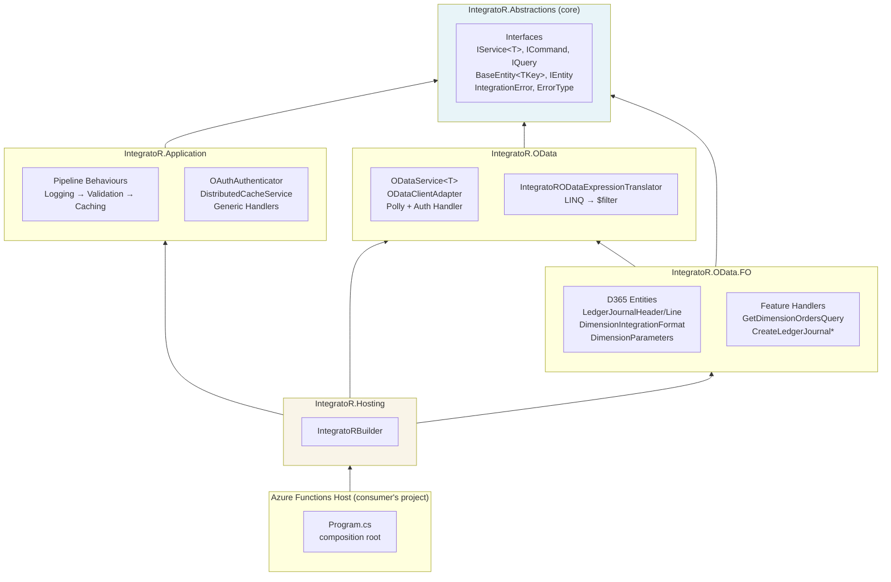

# Understand the Architecture

IntegratoR follows Clean Architecture with dependencies pointing inward — concrete infrastructure layers reference abstract interface layers, never the reverse. The composition root (`IntegratoR.Hosting` plus the consumer's Azure Functions host) ties the layers together via a single `AddIntegratoR(configuration)` call.

## Layer Diagram

## Project Map

| Project | Role | DI entry point |
|---|---|---|
| `IntegratoR.Abstractions` | Domain interfaces (`IService<T>`, `ICommand<T>`, `IQuery<T>`), base entities (`BaseEntity<TKey>`), CQRS contracts, `Result<T>` types (`IntegrationError`, `ErrorType`), STJ and Newtonsoft `Result<T>` converters | Core — no DI registration |
| `IntegratoR.Application` | MediatR pipeline behaviours, generic command/query handlers, `OAuthAuthenticator`, `DistributedCacheService`, the cross-serialiser `Result<T>` wiring | `services.AddApplicationServices()` |
| `IntegratoR.OData` | Generic OData client wrapping PanoramicData.OData.Client, `ODataService<T>`, authentication delegating handler, Polly retry + circuit breaker, `ODataFieldAttribute`, `IntegratoRODataExpressionTranslator` | `services.AddODataClient(configuration)` |
| `IntegratoR.OData.FO` | D365 F&O entities (`LedgerJournalHeader/Line`, `DimensionIntegrationFormat`, `DimensionParameters`), feature-specific commands and handlers, `FOSettings`, dimension builder/reader | `services.AddODataClientFOProxy(configuration)` |
| `IntegratoR.Hosting` | `IntegratoRBuilder`, the single `AddIntegratoR(configuration)` composition root that wires Application + OData + OData.FO + cross-assembly MediatR closing + Durable Functions Result converter | `services.AddIntegratoR(configuration)` |
| `IntegratoR.SampleFunction` | The consumer-side sample — Azure Functions isolated-worker host that wires `AddIntegratoR`, configures Key Vault and Application Insights, and exposes two smoke-test HTTP triggers | Not a library — sample app |
| `IntegratoR.TestKit` | Shared test infrastructure: custom `Result<T>` assertions for FluentAssertions, fakes (`FakeCacheService`, `FakeHttpMessageHandler`), test entity builders | Reference from test projects only |

## Key Patterns

### CQRS via MediatR

Commands and queries are `record` types implementing `ICommand<TResponse>` or `IQuery<TResponse>` (both inherit `MediatR.IRequest<TResponse> + IContext`). The handler is registered automatically by MediatR's assembly scanning when its assembly is passed to `AddConsumerHandlers(...)`.

The framework provides generic Create / Update / Delete commands and GetByKey / GetByFilter queries that work with any entity implementing `IEntity`. Entity-specific custom commands and queries inherit from or compose these — they exist when entity-specific logging context or composition is genuinely useful.

### Result Pattern

Every operation returns `Result<T>` (or non-generic `Result`) from FluentResults. The framework's standard error shape is `IntegrationError(string Code, string Message, ErrorType Type, Exception? Exception)`. The `Result` pattern is used uniformly:

- Pipeline behaviours convert business-logic failures into `Result.Fail(IntegrationError)`.
- Handlers never throw for business errors — they wrap with `Result.Fail`.
- Consumers pattern-match on `result.IsSuccess` / `result.GetError()` instead of `try`/`catch`.
- Exceptions are reserved for genuinely exceptional infrastructure failures (network resets, null refs, cancellation).

### Pipeline Order

`AddApplicationServices` registers the three built-in MediatR pipeline behaviours in this fixed order:

1. **`LoggingBehaviour`** — logs request type, duration, and structured properties from `IContext.GetLoggingContext()`. Wraps handler in `try`/`catch`/`re-throw`/`log`.
2. **`ValidationBehaviour`** — resolves all `IValidator<TRequest>` registrations, runs them, short-circuits with `Validation.Error` on the first failure.
3. **`CachingBehaviour`** — only acts on requests implementing `ICacheableQuery<TResponse>`. Cache hits short-circuit the pipeline; misses run the handler and cache successful responses.
4. **Handler** — the closed-generic `CreateCommandHandler<T>` / `GetByKeyQueryHandler<T>` / consumer-defined handler.

Custom behaviours registered via `services.AddTransient(typeof(IPipelineBehavior<,>), typeof(MyBehaviour<,>))` run **after** the built-in behaviours, between caching and the handler. See [Extend the Pipeline](Extend-the-Pipeline).

### Composite-Key URL Construction

D365 F&O entities are almost always keyed by `(DataAreaId, BusinessKey)`. The framework constructs OData composite-key URLs by:

1. Reading `GetCompositeKey()` from the entity.
2. For reads: building a `$filter` predicate with `eq` on each key field.
3. For writes (Update / Delete, including the batch variants): `ODataClientAdapter` detects the composite (dictionary) key and issues the PATCH / DELETE through an owned raw-`HttpClient` bypass that builds the keyed URL manually — `LedgerJournalHeaders(dataAreaId='USMF',JournalBatchNumber='B0001')` — through the named `"ODataClient"` client so the write carries the same authentication, Polly resilience, and `BaseAddress` as every other request (since v2.0.0).

Both the read and write bypasses are owned, first-party source maintained in this repository. The key-field **names** used in the URL are the `[JsonPropertyName]` wire names (camelCase `dataAreaId`, not CLR `DataAreaId`), because that is what D365 OData expects.

### Two JSON Serialisers

The codebase uses both **System.Text.Json** and **Newtonsoft.Json**, intentionally:

| Serialiser | Used by | Auto-wired by `AddIntegratoR`? |
|---|---|---|
| System.Text.Json | OData responses, `DistributedCacheService` (cache round-trip), Durable Functions data converter | Yes — `AddIntegratoR` wires `DurableTaskWorkerOptions.DataConverter`; `DistributedCacheService` registers in its own static options |
| Newtonsoft.Json | HTTP request/response bodies in Azure Functions worker | No — consumers must wire `JsonConvert.DefaultSettings` in `Program.cs` |

Both serialisers share a `Result<T>` projection helper (`ResultJsonShape`) so wire formats stay aligned. See [Set Up Azure Functions Host](Set-Up-Azure-Functions-Host) for the Newtonsoft wiring snippet.

## Composition Root Flow

The `AddIntegratoR(configuration, configure)` call performs six steps in this order:

1. `AddApplicationServices()` — pipeline behaviours, MediatR, cache service, OAuth authenticator
2. `AddODataClient(configuration)` — HTTP client, Polly policies, OData client, `IService<T>` registration
3. `AddODataClientFOProxy(configuration)` — F&O handlers, F&O entity bindings
4. Cross-assembly MediatR closing — second `AddMediatR` call that scans the Application, F&O, **and** consumer assemblies together so generic CRUD handlers close against F&O **and** consumer entity types
5. Durable Functions data converter — registers `JsonDataConverter` with the STJ Result converters on `DurableTaskWorkerOptions`
6. Consumer validator registration — for each assembly passed to `AddConsumerHandlers`, calls `AddValidatorsFromAssembly(...)` (its MediatR handlers are already registered by the combined scan in step 4)

Step 4 exists because MediatR v12's `RegisterGenericHandlers = true` flag only closes open-generic handlers against types in the **same** scanned assembly. The generic CRUD handlers live in `IntegratoR.Application`, F&O entities live in `IntegratoR.OData.FO` — the layer-local `AddMediatR` calls in steps 1–3 never see them together, so no closed `IRequestHandler<CreateCommand<LedgerJournalHeader>, ...>` registration would be emitted without step 4. The same scan folds in every assembly passed to `AddConsumerHandlers(...)`, so a consumer's extended or custom entities get closed generic handlers exactly like the framework's own.

## Dependency Direction

The arrows in the diagram all point toward `IntegratoR.Abstractions`:

- Higher-level packages (`OData.FO`, `OData`, `Application`, `Hosting`) depend on the abstractions.
- The abstractions never depend on a higher-level package.
- Cross-cutting concerns (auth, cache, resilience) live in concrete packages with interfaces in abstractions.

This is what allows the framework to expose `IService<T>` from `IntegratoR.Abstractions` while the concrete `ODataService<T>` implementation lives in `IntegratoR.OData` — the consumer references only abstractions for testability, the composition root references concretes for runtime wiring.

## See Also

- [Getting Started](Getting-Started) — putting the architecture into a running Azure Functions host
- [Set Up Azure Functions Host](Set-Up-Azure-Functions-Host) — production composition root with all wiring
- [Send Commands](Send-Commands) — the CQRS pattern in practice
- [Extend the Pipeline](Extend-the-Pipeline) — adding to the architecture without modifying it
- [Known Limitations](Known-Limitations) — current architecture gaps tracked transparently
